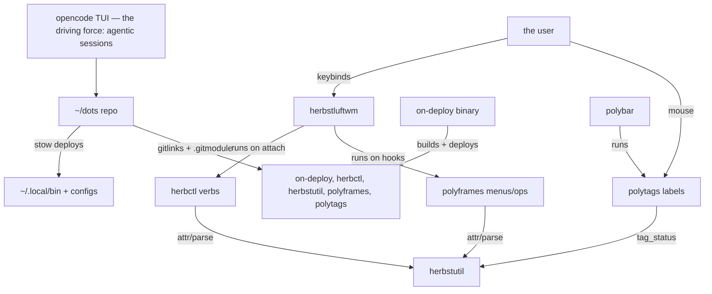
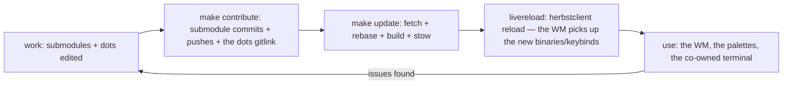

# the ~/dots multi-project — structural + logical map

## structural: who drives what

```mermaid
graph TD
    OC[opencode TUI — the driving force: agentic sessions] --> DOTS[~/dots repo]
    USER[the user] -->|keybinds| HLWM[herbstluftwm]
    USER -->|mouse| PT[polytags labels]
    DOTS -->|stow deploys| BIN[~/.local/bin + configs]
    DOTS -->|gitlinks + .gitmodules| SUB[on-deploy, herbctl, herbstutil, polyframes, polytags]
    OD[on-deploy binary] -->|builds + deploys| SUB
    HLWM -->|runs on attach| HERB[herbctl verbs]
    HLWM -->|runs on hooks| PF[polyframes menus/ops]
    POLYBAR[polybar] -->|runs| PT
    HERB -->|attr/parse| HU[herbstutil]
    PF -->|attr/parse| HU
    PT -->|tag_status| HU
```

## logical: the deployment + use loop

```mermaid
flowchart LR
    A[work: submodules + dots edited] --> B[make contribute: submodule commits + pushes + the dots gitlink]
    B --> C[make update: fetch + rebase + build + stow]
    C --> D[livereload: herbstclient reload — the WM picks up the new binaries/keybinds]
    D --> E[use: the WM, the palettes, the co-owned terminal]
    E -->|issues found| A
```
